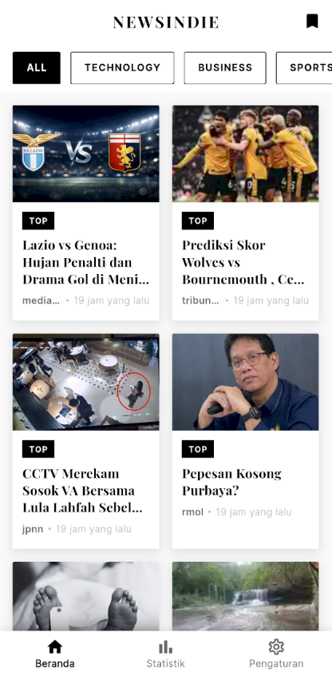
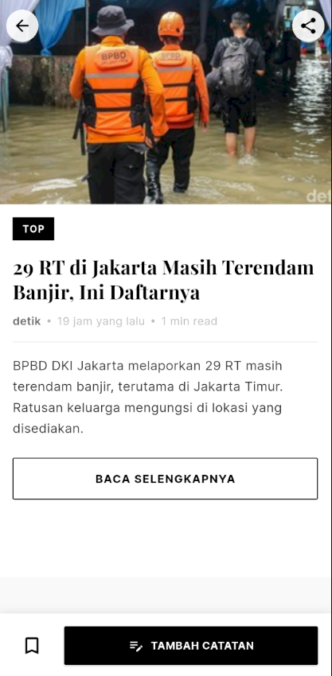
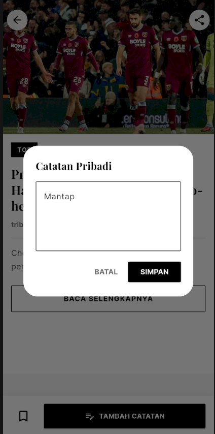
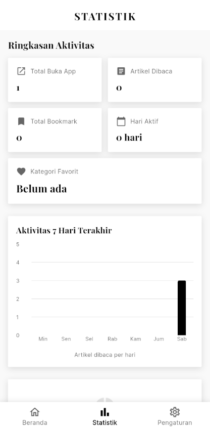
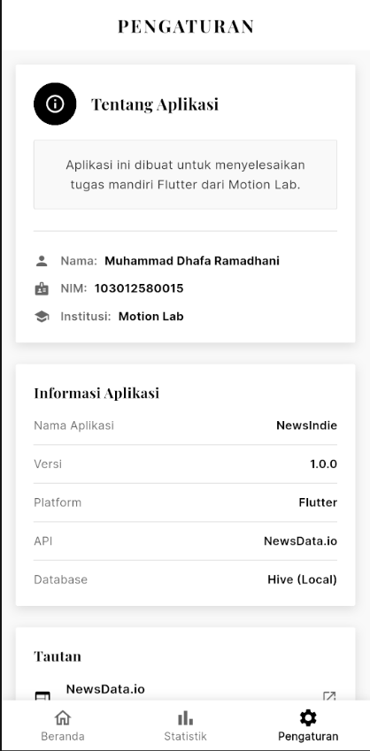

# NewsIndie

Aplikasi pembaca berita dengan desain monokrom dengan mengusung tema koran modern. NewsIndie menyediakan akses ke berita terkini dari berbagai kategori dengan fitur bookmark dan statistik penggunaan.

## Deskripsi

NewsIndie adalah aplikasi mobile yang dirancang untuk memberikan pengalaman membaca berita yang nyaman dan estetis. Aplikasi ini mengintegrasikan NewsData.io API untuk mengambil berita terkini dan menggunakan Hive sebagai database lokal untuk menyimpan bookmark artikel. Dengan desain antarmuka yang minimalis dan modern, NewsIndie menghadirkan pengalaman membaca yang fokus pada konten.

Aplikasi ini dikembangkan sebagai tugas mandiri Flutter dari Motion Lab.

## Fitur Utama

### 1. Feed Berita
- Menampilkan berita terkini dari NewsData.io API
- Filter kategori: All, Technology, Business, Sports, Politics, Entertainment, Health, Science
- Layout grid 2 kolom untuk kemudahan browsing
- Pull-to-refresh untuk update berita terbaru
- Shimmer loading effect saat memuat data

### 2. Detail Artikel
- Tampilan artikel lengkap dengan gambar dan deskripsi
- Hero animation untuk transisi gambar yang smooth
- Tombol share untuk membagikan artikel
- Link eksternal ke artikel sumber
- Fitur bookmark untuk menyimpan artikel favorit
- Catatan pribadi yang dapat ditambahkan dan diedit
- Tampilan catatan pribadi langsung di halaman detail (jika ada)

### 3. Bookmark
- Menyimpan artikel favorit secara lokal
- Full CRUD operations (Create, Read, Update, Delete)
- Swipe-to-delete untuk menghapus bookmark
- Menambahkan dan mengedit catatan pribadi untuk setiap artikel
- Empty state yang informatif

### 4. Statistik Penggunaan
- Ringkasan aktivitas: total aplikasi dibuka, artikel dibaca, bookmark tersimpan, hari aktif
- Kategori favorit yang paling sering dibaca
- Grafik bar chart aktivitas 7 hari terakhir
- Breakdown kategori dengan progress bar dan persentase
- Data analitik tersimpan lokal menggunakan Hive

### 5. Pengaturan
- Informasi tentang aplikasi
- Data pembuat: Muhammad Dhafa Ramadhani - 103012580015
- Informasi teknis aplikasi (versi, platform, API, database)
- Link ke sumber eksternal (NewsData.io, Flutter.dev)

## Screenshot Aplikasi

### Halaman Beranda


### Halaman Detail Artikel


### Halaman Detail dengan Catatan yang akan ditambahkan


### Halaman Detail dengan Catatan yang sudah ditambahkan


### Halaman Bookmark


### Halaman Statistik


### Halaman Pengaturan


## Cara Menjalankan Aplikasi

### Prerequisites
- Flutter SDK (versi 3.0.0 atau lebih baru)
- Dart SDK
- Android Studio / VS Code dengan Flutter extension
- Emulator Android / iOS atau perangkat fisik

### Langkah-langkah Instalasi

1. Clone atau download repository ini
```bash
git clone <repository-url>
cd newsindie
```

2. Install dependencies
```bash
flutter pub get
```

3. Konfigurasi API Key NewsData.io

Buka file `lib/utils/constants.dart` dan ganti API key dengan API key Anda:
```dart
static const String apiKey = 'YOUR_API_KEY_HERE';
```

Untuk mendapatkan API key gratis, daftar di [NewsData.io](https://newsdata.io)

4. Jalankan aplikasi
```bash
flutter run
```

Atau untuk mode release:
```bash
flutter run --release
```

### Build APK

Untuk membuat file APK:
```bash
flutter build apk
```

Untuk membuat APK terpisah per arsitektur (ukuran lebih kecil):
```bash
flutter build apk --split-per-abi
```

File APK akan tersimpan di: `build/app/outputs/flutter-apk/`

## Penggunaan

1. **Membaca Berita**
   - Buka aplikasi dan lihat feed berita di halaman Beranda
   - Filter berita berdasarkan kategori dengan tap pada chip kategori
   - Tap pada kartu berita untuk membaca detail lengkap
   - Pull down untuk refresh dan mendapatkan berita terbaru

2. **Menyimpan Artikel (Bookmark)**
   - Di halaman detail artikel, tap icon bookmark di bottom bar
   - Artikel akan tersimpan dan dapat diakses di halaman Bookmark
   - Tap icon bookmark untuk bookmark page dari halaman Beranda

3. **Menambahkan Catatan Pribadi**
   - Di halaman detail artikel yang sudah di-bookmark, tap tombol "TAMBAH CATATAN"
   - Tulis catatan Anda di dialog yang muncul
   - Catatan akan muncul di bawah artikel
   - Edit catatan dengan tap icon edit di section catatan

4. **Melihat Statistik**
   - Tap tab Statistik di bottom navigation
   - Lihat ringkasan penggunaan aplikasi Anda
   - Pantau grafik aktivitas 7 hari terakhir
   - Cek kategori berita favorit Anda

5. **Mengakses Pengaturan**
   - Tap tab Pengaturan di bottom navigation
   - Lihat informasi tentang aplikasi
   - Akses link eksternal ke sumber terkait

## Catatan Pengembangan

Aplikasi ini dikembangkan dengan prinsip:
- Simple Architecture: Menghindari arsitektur kompleks untuk kemudahan maintenance
- Monochrome Design: Palet warna grayscale bergaya koran modern
- State Management: Menggunakan GetX untuk reactive programming
- Local-First: Data bookmark dan statistik tersimpan lokal untuk akses offline
- User Experience: Fokus pada navigasi intuitif dan feedback yang jelas

## Pembuat

Muhammad Dhafa Ramadhani
NIM: 103012580015

Tugas Mandiri Flutter - Motion Lab

## Lisensi

Aplikasi ini dibuat untuk keperluan tugas mandiri dari Motion Lab.